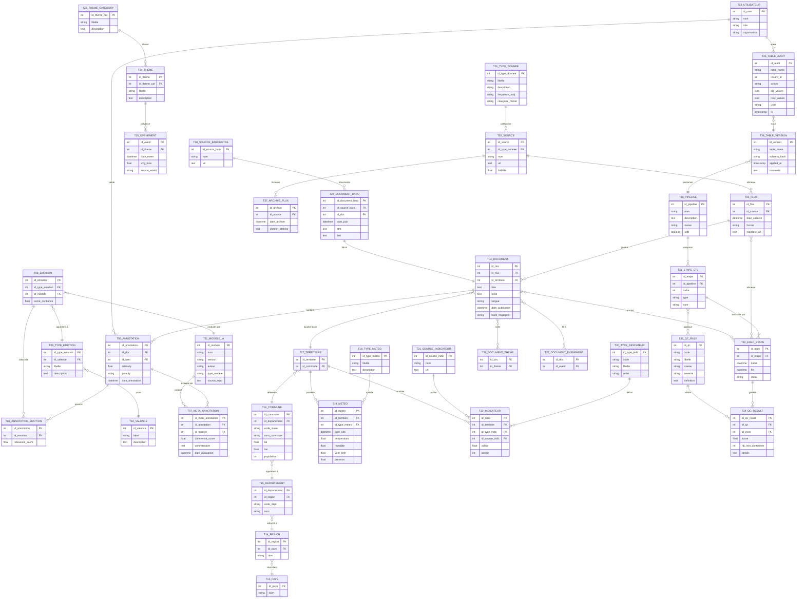

# DataSens — MCD (ERD Mermaid)

```mermaid
erDiagram

%% === DOMAINE COLLECTE ===
T01_TYPE_DONNEE ||--o{ T02_SOURCE : "catégorise"
T02_SOURCE ||--o{ T03_FLUX : "alimente"
T03_FLUX ||--o{ T04_DOCUMENT : "génère"
T02_SOURCE ||--o{ T37_ARCHIVE_FLUX : "historise"

%% === ANNOTATION & EMOTIONS ===
T04_DOCUMENT ||--o{ T05_ANNOTATION : "contient"
T05_ANNOTATION ||--o{ T06_ANNOTATION_EMOTION : "associe"
T08_EMOTION ||--o{ T06_ANNOTATION_EMOTION : "rattachée"
T08_EMOTION }o--|| T09_TYPE_EMOTION : "appartient à"
T09_TYPE_EMOTION }o--|| T10_VALENCE : "porte"
T08_EMOTION }o--|| T11_MODELE_IA : "produite par"
T05_ANNOTATION ||--o{ T07_META_ANNOTATION : "évaluée par"
T11_MODELE_IA ||--o{ T07_META_ANNOTATION : "produit"
T12_UTILISATEUR ||--o{ T05_ANNOTATION : "valide"

%% === GÉOGRAPHIE ===
T04_DOCUMENT }o--|| T17_TERRITOIRE : "localisé dans"
T17_TERRITOIRE }o--|| T16_COMMUNE : "référence"
T16_COMMUNE }o--|| T15_DEPARTEMENT : "appartient à"
T15_DEPARTEMENT }o--|| T14_REGION : "rattaché à"
T14_REGION }o--|| T13_PAYS : "situé dans"

%% === CONTEXTE : MÉTÉO & INDICATEURS ===
T18_TYPE_METEO ||--o{ T19_METEO : "qualifie"
T17_TERRITOIRE ||--o{ T19_METEO : "possède"
T20_TYPE_INDICATEUR ||--o{ T22_INDICATEUR : "définit"
T21_SOURCE_INDICATEUR ||--o{ T22_INDICATEUR : "publie"
T17_TERRITOIRE ||--o{ T22_INDICATEUR : "constate"

%% === THÈMES / ÉVÉNEMENTS ===
T23_THEME_CATEGORY ||--o{ T24_THEME : "classe"
T24_THEME ||--o{ T25_EVENEMENT : "influence"
T04_DOCUMENT }o--o{ T26_DOCUMENT_THEME : "traite"
T04_DOCUMENT }o--o{ T27_DOCUMENT_EVENEMENT : "lié à"

%% === BAROMÈTRES ===
T28_SOURCE_BAROMETRE ||--o{ T29_DOCUMENT_BARO : "documente"
T29_DOCUMENT_BARO ||--|| T04_DOCUMENT : "décrit"

%% === PIPELINE / QUALITÉ ===
T30_PIPELINE ||--o{ T31_ETAPE_ETL : "compose"
T31_ETAPE_ETL ||--o{ T32_EXEC_ETAPE : "exécutée par"
T03_FLUX }o--o{ T32_EXEC_ETAPE : "alimente"
T04_DOCUMENT }o--o{ T32_EXEC_ETAPE : "produit"
T31_ETAPE_ETL }o--o{ T33_QC_RULE : "applique"
T32_EXEC_ETAPE ||--o{ T34_QC_RESULT : "génère"
T33_QC_RULE ||--o{ T34_QC_RESULT : "vérifie"

%% === GOUVERNANCE / VERSIONNING ===
T12_UTILISATEUR ||--o{ T35_TABLE_AUDIT : "opère"
T35_TABLE_AUDIT }o--|| T36_TABLE_VERSION : "trace"
T36_TABLE_VERSION }o--|| T30_PIPELINE : "versionne"

%% ===================== TABLES =====================
T01_TYPE_DONNEE {
  int id_type_donnee PK
  string libelle
  string description
  string frequence_maj
  string categorie_metier
}
T02_SOURCE {
  int id_source PK
  int id_type_donnee FK
  string nom
  text url
  float fiabilite
}
T03_FLUX {
  int id_flux PK
  int id_source FK
  datetime date_collecte
  string format
  text manifest_uri
}
T37_ARCHIVE_FLUX {
  int id_archive PK
  int id_source FK
  datetime date_archive
  text chemin_archive
}
T04_DOCUMENT {
  int id_doc PK
  int id_flux FK
  int id_territoire FK
  text titre
  text texte
  string langue
  datetime date_publication
  string hash_fingerprint
}
T05_ANNOTATION {
  int id_annotation PK
  int id_doc FK
  int id_user FK
  float intensity
  string polarity
  datetime date_annotation
}
T06_ANNOTATION_EMOTION {
  int id_annotation FK
  int id_emotion FK
  float relevance_score
}
T07_META_ANNOTATION {
  int id_meta_annotation PK
  int id_annotation FK
  int id_modele FK
  float coherence_score
  text commentaire
  datetime date_evaluation
}
T08_EMOTION {
  int id_emotion PK
  int id_type_emotion FK
  int id_modele FK
  float score_confiance
}
T09_TYPE_EMOTION {
  int id_type_emotion PK
  int id_valence FK
  string libelle
  text description
}
T10_VALENCE {
  int id_valence PK
  string label
  text description
}
T11_MODELE_IA {
  int id_modele PK
  string nom
  string version
  string auteur
  string type_modele
  text source_repo
}
T12_UTILISATEUR {
  int id_user PK
  string nom
  string role
  string organisation
}
T13_PAYS {
  int id_pays PK
  string nom
}
T14_REGION {
  int id_region PK
  int id_pays FK
  string nom
}
T15_DEPARTEMENT {
  int id_departement PK
  int id_region FK
  string code_dept
  string nom
}
T16_COMMUNE {
  int id_commune PK
  int id_departement FK
  string code_insee
  string nom_commune
  float lat
  float lon
  int population
}
T17_TERRITOIRE {
  int id_territoire PK
  int id_commune FK
}
T18_TYPE_METEO {
  int id_type_meteo PK
  string libelle
  text description
}
T19_METEO {
  int id_meteo PK
  int id_territoire FK
  int id_type_meteo FK
  datetime date_obs
  float temperature
  float humidite
  float vent_kmh
  float pression
}
T20_TYPE_INDICATEUR {
  int id_type_indic PK
  string code
  string libelle
  string unite
}
T21_SOURCE_INDICATEUR {
  int id_source_indic PK
  string nom
  text url
}
T22_INDICATEUR {
  int id_indic PK
  int id_territoire FK
  int id_type_indic FK
  int id_source_indic FK
  float valeur
  int annee
}
T23_THEME_CATEGORY {
  int id_theme_cat PK
  string libelle
  text description
}
T24_THEME {
  int id_theme PK
  int id_theme_cat FK
  string libelle
  text description
}
T25_EVENEMENT {
  int id_event PK
  int id_theme FK
  datetime date_event
  float avg_tone
  string source_event
}
T26_DOCUMENT_THEME {
  int id_doc FK
  int id_theme FK
}
T27_DOCUMENT_EVENEMENT {
  int id_doc FK
  int id_event FK
}
T28_SOURCE_BAROMETRE {
  int id_source_baro PK
  string nom
  text url
}
T29_DOCUMENT_BARO {
  int id_document_baro PK
  int id_source_baro FK
  int id_doc FK
  datetime date_pub
  text titre
  text lien
}
T30_PIPELINE {
  int id_pipeline PK
  string nom
  text description
  string owner
  boolean actif
}
T31_ETAPE_ETL {
  int id_etape PK
  int id_pipeline FK
  int ordre
  string type
  string nom
}
T32_EXEC_ETAPE {
  int id_exec PK
  int id_etape FK
  datetime debut
  datetime fin
  string statut
}
T33_QC_RULE {
  int id_qc PK
  string code
  string libelle
  string niveau
  string severite
  text definition
}
T34_QC_RESULT {
  int id_qc_result PK
  int id_qc FK
  int id_exec FK
  float score
  int nb_non_conformes
  text details
}
T35_TABLE_AUDIT {
  int id_audit PK
  string table_name
  int record_id
  string action
  json old_values
  json new_values
  string user
  timestamp ts
}
T36_TABLE_VERSION {
  int id_version PK
  string table_name
  string schema_hash
  timestamp applied_at
  text comment
}
```
