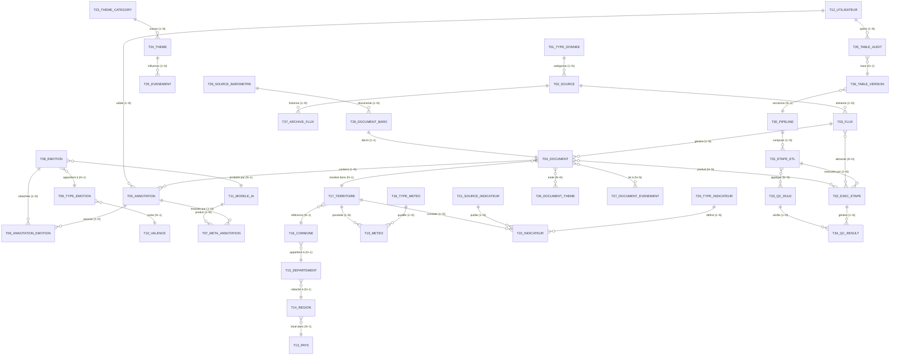

# DataSens — Modèle Logique de Données (MLD)

```mermaid
erDiagram

%% === DOMAINE COLLECTE ===

T01_TYPE_DONNEE ||--o{ T02_SOURCE : "catégorise (1–N)"
T02_SOURCE ||--o{ T03_FLUX : "alimente (1–N)"
T03_FLUX ||--o{ T04_DOCUMENT : "génère (1–N)"
T02_SOURCE ||--o{ T37_ARCHIVE_FLUX : "historise (1–N)"

%% === ANNOTATION & EMOTIONS ===

T04_DOCUMENT ||--o{ T05_ANNOTATION : "contient (1–N)"
T05_ANNOTATION ||--o{ T06_ANNOTATION_EMOTION : "associe (1–N)"
T08_EMOTION ||--o{ T06_ANNOTATION_EMOTION : "rattachée (1–N)"
T08_EMOTION }o--|| T09_TYPE_EMOTION : "appartient à (N–1)"
T09_TYPE_EMOTION }o--|| T10_VALENCE : "porte (N–1)"
T08_EMOTION }o--|| T11_MODELE_IA : "produite par (N–1)"
T05_ANNOTATION ||--o{ T07_META_ANNOTATION : "évaluée par (1–N)"
T11_MODELE_IA ||--o{ T07_META_ANNOTATION : "produit (1–N)"
T12_UTILISATEUR ||--o{ T05_ANNOTATION : "valide (1–N)"

%% === GÉOGRAPHIE ===

T04_DOCUMENT }o--|| T17_TERRITOIRE : "localisé dans (N–1)"
T17_TERRITOIRE }o--|| T16_COMMUNE : "référence (N–1)"
T16_COMMUNE }o--|| T15_DEPARTEMENT : "appartient à (N–1)"
T15_DEPARTEMENT }o--|| T14_REGION : "rattaché à (N–1)"
T14_REGION }o--|| T13_PAYS : "situé dans (N–1)"

%% === CONTEXTE : MÉTÉO & INDICATEURS ===

T18_TYPE_METEO ||--o{ T19_METEO : "qualifie (1–N)"
T17_TERRITOIRE ||--o{ T19_METEO : "possède (1–N)"
T20_TYPE_INDICATEUR ||--o{ T22_INDICATEUR : "définit (1–N)"
T21_SOURCE_INDICATEUR ||--o{ T22_INDICATEUR : "publie (1–N)"
T17_TERRITOIRE ||--o{ T22_INDICATEUR : "constate (1–N)"

%% === THÈMES / ÉVÉNEMENTS ===

T23_THEME_CATEGORY ||--o{ T24_THEME : "classe (1–N)"
T24_THEME ||--o{ T25_EVENEMENT : "influence (1–N)"
T04_DOCUMENT }o--o{ T26_DOCUMENT_THEME : "traite (N–N)"
T04_DOCUMENT }o--o{ T27_DOCUMENT_EVENEMENT : "lié à (N–N)"

%% === BAROMÈTRES ===

T28_SOURCE_BAROMETRE ||--o{ T29_DOCUMENT_BARO : "documente (1–N)"
T29_DOCUMENT_BARO ||--|| T04_DOCUMENT : "décrit (1–1)"

%% === PIPELINE / QUALITÉ ===

T30_PIPELINE ||--o{ T31_ETAPE_ETL : "compose (1–N)"
T31_ETAPE_ETL ||--o{ T32_EXEC_ETAPE : "exécutée par (1–N)"
T03_FLUX }o--o{ T32_EXEC_ETAPE : "alimente (N–N)"
T04_DOCUMENT }o--o{ T32_EXEC_ETAPE : "produit (N–N)"
T31_ETAPE_ETL }o--o{ T33_QC_RULE : "applique (N–N)"
T32_EXEC_ETAPE ||--o{ T34_QC_RESULT : "génère (1–N)"
T33_QC_RULE ||--o{ T34_QC_RESULT : "vérifie (1–N)"

%% === GOUVERNANCE / VERSIONNING ===

T12_UTILISATEUR ||--o{ T35_TABLE_AUDIT : "opère (1–N)"
T35_TABLE_AUDIT }o--|| T36_TABLE_VERSION : "trace (N–1)"
T36_TABLE_VERSION }o--|| T30_PIPELINE : "versionne (N–1)"
```
