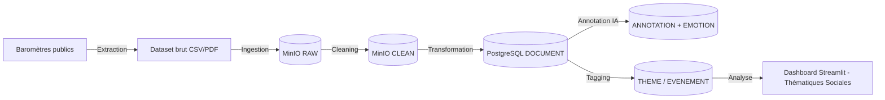

# 🧭

# Audit & intégration des sources barométriques – Bloc E1

# 🎯 Objectif

Créer un socle de sources d’opinion et de perception (les “baromètres”) qui alimenteront :

- la table THEME_CATEGORY (macro-catégories positives / de tension)
- la table THEME (sous-thèmes détaillés)
- les DOCUMENT annotés (articles, extraits, synthèses)
- les indicateurs de contexte (INDICATEUR)

# 🧩

# 1️⃣ Les grands types de baromètres à intégrer

| **Type de source** | **Exemple concret** | **Thématique couverte** | **Format prévu** |
| --- | --- | --- | --- |
| 🔹 Baromètre de confiance politique & sociale | CEVIPOF – La confiance des Français dans la politique | Société, gouvernance, démocratie, institutions | CSV / PDF / API |
| 🔹 Baromètre des émotions et du moral des Français | Kantar Public / Ipsos Mood of France | Joie, anxiété, colère, espoir (→ table EMOTION) | CSV / scraping |
| 🔹 Baromètre environnemental | ADEME / IFOP pour la transition écologique | Écologie, énergie, climat, sobriété | Dataset plat + API |
| 🔹 Baromètre économique et social | INSEE Conjoncture + BVA Observatoire social | Pouvoir d’achat, chômage, inflation, emploi | Base SQL / CSV |
| 🔹 Baromètre des médias et de la confiance | La Croix – Baromètre Kantar sur les médias | Information, confiance médiatique, fake news | Web scraping |
| 🔹 Baromètre sport & cohésion sociale | Ministère des Sports / CNOSF / Paris 2024 | Sport, bien-être, fierté nationale, cohésion | CSV / API |
| 🔹 Baromètre des discriminations et égalité | Défenseur des Droits / IFOP | Inclusion, diversité, égalité femmes-hommes | CSV / API |
| 🔹 Baromètre santé mentale et bien-être | Santé Publique France – CoviPrev | Stress, anxiété, santé mentale post-COVID | CSV |
| 🔹 Baromètre climat social et tensions | Elabe / BFMTV Opinion 2024 | Colère, frustration, confiance, peur | Web Scraping |
| 🔹 Baromètre innovation et IA | CNIL / France IA / Capgemini Research Institute | Adoption de l’IA, confiance numérique | PDF / API |

# 🧩

# 2️⃣ Taxonomie enrichie (12 macro-thèmes)

Tu as raison, on reprend ta version enrichie, qui alimente la table THEME_CATEGORY et la table THEME (sous-niveaux).

**🔸 Catégories (table THEME_CATEGORY)**

| **id** | **Catégorie** | **Type** |
| --- | --- | --- |
| 1 | Société & Confiance | Tension |
| 2 | Économie & Pouvoir d’achat | Tension |
| 3 | Politique & Gouvernance | Tension |
| 4 | Écologie & Climat | Tension |
| 5 | Santé & Bien-être | Tension |
| 6 | Inclusion & Égalité | Tension |
| 7 | Innovation & Numérique | Moteur positif |
| 8 | Sport & Cohésion | Moteur positif |
| 9 | Culture & Identité | Moteur positif |
| 10 | Travail & Formation | Moteur positif |
| 11 | Jeunesse & Éducation | Moteur positif |
| 12 | Solidarité & Engagement | Moteur positif |

**🔹 Sous-thèmes (table THEME)**

| **id** | **id_category** | **Thème** | **Description** |
| --- | --- | --- | --- |
| 1 | 1 | Confiance institutionnelle | Relation citoyens / État |
| 2 | 2 | Pouvoir d’achat | Ressenti économique |
| 3 | 4 | Changement climatique | Perception des risques |
| 4 | 5 | Santé mentale | Bien-être émotionnel |
| 5 | 6 | Diversité et égalité | Inclusion sociale |
| 6 | 7 | Intelligence artificielle | Confiance dans la technologie |
| 7 | 8 | Jeux Olympiques 2024 | Fierté et cohésion nationale |
| 8 | 9 | Médias et information | Rapport à la vérité |
| 9 | 10 | Marché du travail | Emploi et évolution pro |
| 10 | 11 | Système éducatif | École, orientation |
| 11 | 12 | Engagement associatif | Actions locales |
| 12 | 3 | Tensions politiques | Colère, abstention |

# 🧩

# 3️⃣ Liens vers les tables de ton schéma

| **Table** | **Ce que tu ajoutes / modifies** |
| --- | --- |
| TYPE_DONNEE | Ajout de la catégorie “Baromètre” |
| SOURCE | Ajout de 10 lignes issues de ces baromètres |
| THEME_CATEGORY | Nouvelle table hiérarchique des macro-thèmes |
| THEME | Sous-thèmes reliés à la catégorie et à EVENEMENT |
| DOCUMENT | Les extraits textuels issus des baromètres (résumés PDF / articles) |
| EVENEMENT | Pointage sur des dates clés (JO 2024, crises, etc.) |
| INDICATEUR | Lié aux données chiffrées (pouvoir d’achat, emploi, climat social) |

# 🧩

# 4️⃣ Pipeline (flux → thème → document)

# 🧠

# 5️⃣ Avantage pédagogique

👉 Ces baromètres rendent ton projet plus crédible scientifiquement :

- Alignement avec les sources officielles de mesure du moral national
- Données fiables, RGPD-safe et ouvertes (Open Data France, INSEE, IFOP, ADEME)
- Impact positif : l’IA n’analyse pas que du bruit médiatique, mais du ressenti collectif
